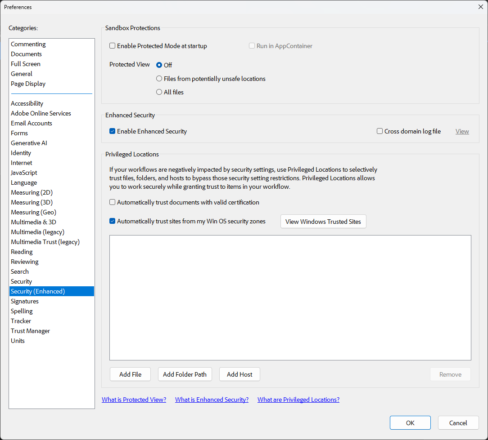

# Latex Beamer PDF slide with video player

This LaTeX code creates a Beamer presentation with a PDF slide which includes a video player displaying a H.264 AVI movie file.
This was achieved using the *multimedia* Latex package.

I tested it under GNU/Linux with *Okular*.

Also I tested it under Windows with *Adobe Acrobat*. Note that it only works if you disable *Enable Protected Mode at Startup*.

